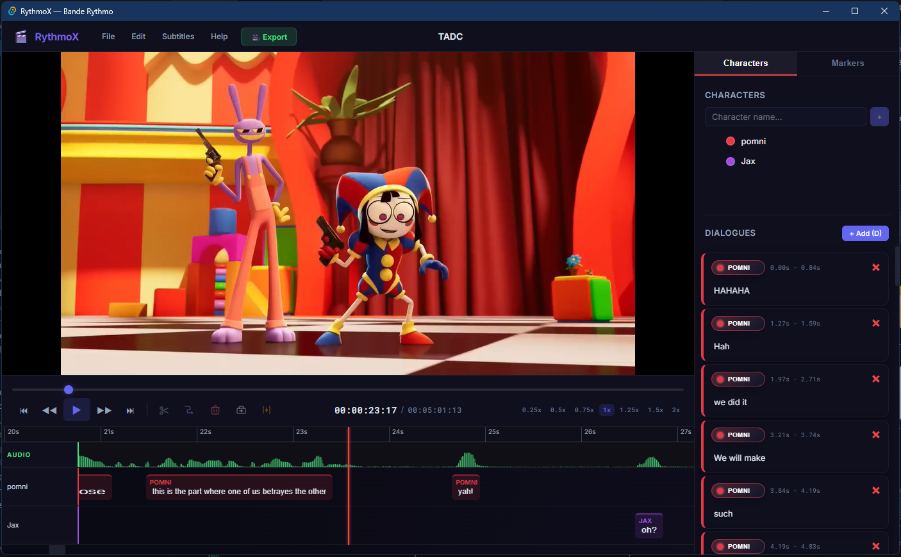
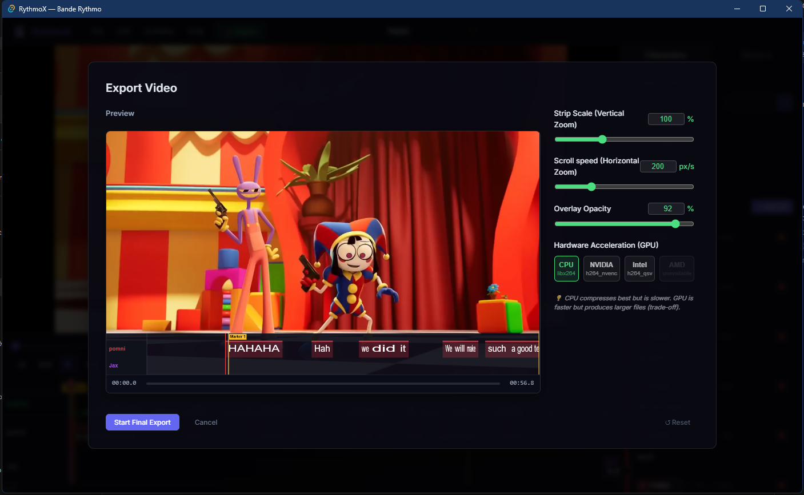

# RythmoX

**RythmoX** is a modern, free desktop application for creating and editing **rythmo bands** (bande rythmo) — the scrolling text strips used in dubbing and voice-over work to synchronize dialogue with video. Thanks to AI tools, this project took me only 3 days to develop (would have probably taken 1-2 months without them).

> Built with Tauri v2 + React 19 + TypeScript. Windows only (for now).

---

## Why RythmoX?

The most widely used free tool for rythmo bands, [Cappella](https://cappella.app/), hasn't been updated since 2008. Cappella does not support "CTRL+Z" and bigger files, which force users to downdgrade their videos to use Cappella. Thankfully RythmoX was built to offer a modern, accessible alternative with a clean interface and GPU-accelerated export.

**Warning:** Since this is a new project, if you have any suggestions/features, write them in the "ISSUES" section of GitHub. I may implement them as soon as possible.

### Main view


### Export view


### Exported video preview
[](images/exported_preview.mp4)

---

## Features

- **Video import** — drag & drop or open MP4, MOV, MKV, AVI, and more; incompatible formats are automatically converted to a proxy
- **Multi-character timeline** — one lane per character/role, with color coding
- **Bande Rythmo canvas** — scrolling text strip synchronized to playback, with the playhead fixed at 25% from the left
- **Dialogue editor** — inline text editing, font/style per dialogue, role switching
- **Visual cuts (C)** — insert internal text separators inside a dialogue without splitting it into two blocks
- **Split (X)** — cut a dialogue in two at the playhead position
- **Merge (F)** — fuse two adjacent dialogues from the same character into one
- **Markers** — place and label time markers on the timeline
- **Subtitle import (SRT / ASS)** — import subtitle files and automatically convert them into dialogue blocks on the timeline; when importing ASS files, style names and actor fields are read as roles and each role is automatically mapped to a separate character lane; SRT files support a `[Role Name]` prefix convention that is also extracted as a character
- **Subtitle export (SRT / ASS)** — export the full timeline back to a subtitle file
- **Multi-select** — hold `Ctrl` and click to select multiple dialogues at once; `Del` deletes all of them in one action
- **GPU-accelerated export** — render the video with the rythmo band burned in; supports CPU (libx264), NVIDIA (NVENC), AMD (AMF), and Intel (QSV)
- **Trim handles** — define export in/out points directly on the timeline
- **Undo/Redo** — full history for all project edits
- **Recent projects** — quick access to previously opened projects
- **Save / Save As** — projects saved as `.rythmox` JSON files

---

## Keyboard Shortcuts

| Shortcut | Action |
|---|---|
| `Space` | Play / Pause |
| `D` | Add dialogue at playhead on selected layer |
| `X` | Split selected dialogue at playhead |
| `C` | Insert visual cut inside selected dialogue at playhead |
| `F` | Merge two selected dialogues (same character) |
| `M` | Add marker at playhead |
| `Del` | Delete selected dialogue(s) or marker(s) |
| `Ctrl+Z` | Undo |
| `Ctrl+Y` / `Ctrl+Shift+Z` | Redo |
| `Ctrl+N` | New project |
| `Ctrl+O` | Open project |
| `Ctrl+S` | Save project |
| `Ctrl+Shift+S` | Save As |
| `←` / `→` | Step one frame backward / forward |

---

## Building from Source

### Prerequisites

- [Node.js](https://nodejs.org/) 18+
- [Rust](https://rustup.rs/) (stable)
- [Tauri CLI v2](https://tauri.app/)

### Dev

```bash
npm install
npm run tauri dev
```

### Production build

```bash
npm run tauri build
# Installer output: src-tauri/target/release/bundle/nsis/
```

---

## FFmpeg

The app bundles a **custom lightweight `ffmpeg.exe`** compiled with only the codecs and filters needed for export. This keeps the binary small.

### How to build the custom ffmpeg.exe

#### 1. Install msys2

Download and install [msys2](https://www.msys2.org/). Open the UCRT64 shell.

#### 2. Install build tools

```bash
pacman -S --needed base-devel git mingw-w64-ucrt-x86_64-toolchain mingw-w64-ucrt-x86_64-x264 mingw-w64-ucrt-x86_64-nasm
# Press Enter to select all
```

#### 3. Clone FFmpeg

```bash
git clone https://git.ffmpeg.org/ffmpeg.git ffmpeg-src
cd ffmpeg-src
```

#### 4. Configure and build

```bash
./configure --disable-everything \
  --enable-gpl --enable-static --disable-shared --disable-debug --disable-doc \
  --enable-libx264 \
  --enable-encoder=libx264,aac,wrapped_avframe,pcm_s16le \
  --enable-decoder=h264,hevc,aac,mp3,ac3,eac3,pcm_s16le,pcm_s24le,pcm_f32le,mjpeg,mpeg4,vorbis,opus \
  --enable-parser=h264,hevc,aac,mpegaudio,ac3,vorbis,opus \
  --enable-filter=scale,overlay,format,color,split,nullsrc,crop,transpose,rotate,vflip,hflip,trim,atrim,aresample \
  --enable-protocol=file \
  --enable-muxer=mov,mp4,avi,matroska,wav \
  --enable-demuxer=mov,avi,matroska,wav,aac,mp3 \
  --disable-avdevice --disable-swscale-alpha

make -j$(nproc)
```

Place the resulting `ffmpeg.exe` and `ffprobe.exe` in `src-tauri/resources/`.

---

## Links

- GitHub: https://github.com/Nasser2003/RythmoX
- Support on Patreon: https://patreon.com/NasserKotiyev

